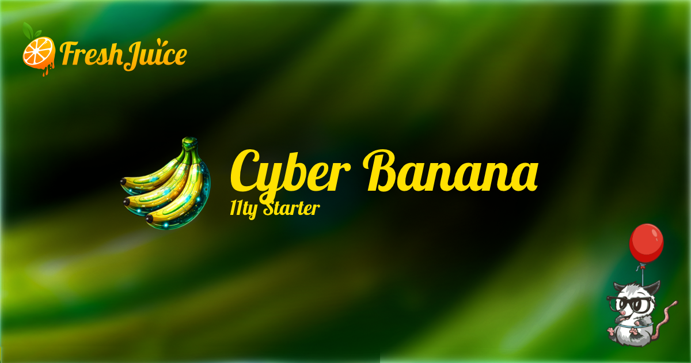

# Cyber Banana 11ty Starter



A cyberpunk-themed developer portfolio starter for building fast, neon-lit static websites with [Eleventy](https://www.11ty.dev/) and [TailwindCSS v4](https://tailwindcss.com/).

**[Live Demo](https://cyber-banana-starter.freshjuice.dev)**

## Features

- **Eleventy v3** - Fast static site generation with ES modules
- **TailwindCSS v4** - Utility-first CSS with OKLCH colors for vibrant neons
- **Vanilla JavaScript** - No framework overhead, just clean ES6+ code
- **Dark Mode Only** - Cyberpunk aesthetic, no light mode distractions
- **Projects Showcase** - Dedicated section with cyberpunk image filters
- **Technical Blog** - Year-grouped archive with terminal styling
- **Pagefind** - Static search with zero configuration
- **Shiki** - Tokyo Night syntax highlighting for code blocks
- **eleventy-img** - Automatic image optimization (AVIF, WebP, JPEG)
- **Phosphor Icons** - 6,000+ icons with multiple weights
- **Cyberpunk Typography** - Orbitron headings + Share Tech Mono body
- **RGB Glitch Effects** - Chromatic aberration shadows on hover
- **Terminal UI** - CLI-styled footer and sitemap
- **SEO Ready** - Sitemap, RSS feed, meta tags, Open Graph

## Quick Start

### Prerequisites

- Node.js 24 or higher (see `.nvmrc`)
- npm

### Installation

```bash
# Clone the repository
git clone https://github.com/freshjuice-dev/cyber-banana-11ty-starter.git
cd cyber-banana-11ty-starter

# Install dependencies
npm install

# Start development server
npm run dev
```

Open http://localhost:8080 to view your site.

### Available Scripts

| Command | Description |
|---------|-------------|
| `npm run dev` | Start development server with hot reload |
| `npm run build` | Build for production |
| `npm run clean` | Remove `_site` folder |

## Project Structure

```
cyber-banana-11ty-starter/
├── src/
│   ├── _data/                 # Global data files
│   │   ├── build.js           # Build info (git hash, timestamp)
│   │   ├── metadata.yaml      # Site metadata
│   │   ├── header.yaml        # Navigation config
│   │   ├── footer.yaml        # Footer configuration
│   │   └── socials.yaml       # Social media links
│   ├── _includes/
│   │   ├── layouts/           # Page layouts
│   │   │   ├── base.njk       # Base HTML layout
│   │   │   ├── page.njk       # Standard page layout
│   │   │   ├── post.njk       # Blog post layout
│   │   │   ├── project.njk    # Project page layout
│   │   │   ├── legal.njk      # Legal pages layout
│   │   │   └── error.njk      # Error pages layout
│   │   ├── partials/          # Reusable partials
│   │   │   ├── header.njk
│   │   │   ├── footer.njk
│   │   │   └── metatags.njk
│   │   └── _components/       # Nunjucks component macros
│   │       └── index.njk
│   ├── assets/
│   │   ├── css/
│   │   │   ├── main.css       # Entry point with @theme
│   │   │   ├── _base.css      # CSS reset, typography
│   │   │   ├── _typography.css
│   │   │   ├── _buttons.css   # RGB glitch buttons
│   │   │   ├── _forms.css
│   │   │   ├── _utilities.css
│   │   │   ├── _dark-mode.css
│   │   │   ├── _pagefind.css
│   │   │   └── _youtube.css
│   │   └── js/
│   │       ├── main.js
│   │       └── components/
│   │           ├── mobile-menu.js
│   │           └── accordion.js
│   ├── projects/              # Project showcase
│   ├── blog/                  # Blog posts
│   ├── legal/                 # Legal pages
│   ├── pages/                 # Site pages
│   └── static/                # Static files (favicons, etc.)
├── config/                    # Eleventy configuration
│   ├── collections.js
│   ├── filters.js
│   ├── shortcodes.js
│   ├── transforms.js
│   └── plugins.js
└── eleventy.config.js
```

## Adding Content

### Projects

Create a markdown file in `src/projects/`:

```yaml
---
title: My Awesome Project
description: A brief description of what this project does.
date: 2025-01-01
slug: my-project
image: /assets/images/project-screenshot.jpg
image_alt: Project screenshot
tech:
  - JavaScript
  - Node.js
  - PostgreSQL
github: https://github.com/username/project
demo: https://project-demo.example.com
featured: true
---

Your project description and details go here...
```

### Blog Posts

Create a markdown file in `src/blog/`:

```yaml
---
title: My Blog Post
description: What this post is about.
date: 2025-01-01
image: /assets/images/post-image.jpg
tags:
  - javascript
  - tutorial
---

Your post content goes here...
```

## Components

Import and use Nunjucks macros in your templates:

```nunjucks


{# Buttons with RGB glitch effect #}
{{ button({ text: "View Project", url: "/projects/", variant: "primary" }) }}
{{ button({ text: "Learn More", variant: "outline" }) }}

{# Badges #}
{{ badge({ text: "TypeScript", variant: "primary" }) }}
```

## Customizing Colors

Edit the color palette in `src/assets/css/main.css`:

```css
@theme {
  /* Primary: Neon Banana Yellow */
  --color-primary-500: oklch(0.92 0.19 95);

  /* Dark: Deep cyberpunk backgrounds */
  --color-dark-900: oklch(0.04 0.004 270);
}
```

The theme uses OKLCH colors for vibrant neons that pop on dark backgrounds.

## Typography

The starter uses cyberpunk-themed Google Fonts:

- **Orbitron** - Futuristic font for all headings
- **Share Tech Mono** - Monospace font for body text
- **System Monospace** - For code blocks

## Configuration

### Site Metadata

Edit `src/_data/metadata.yaml`:

```yaml
title: "Your Site Name"
description: "Your site description"
url: "https://yoursite.com"
language: "en"
author: "Your Name"
email: "hello@example.com"
themeColor: "#FFE500"
```

### Navigation

Edit `src/_data/header.yaml`:

```yaml
navigation:
  - label: "Home"
    url: "/"
  - label: "Projects"
    url: "/projects/"
  - label: "Blog"
    url: "/blog/"
```

## Generated Files

| File | Description |
|------|-------------|
| `/sitemap.xml` | XML sitemap with cyberpunk styling |
| `/robots.txt` | Robots directives |
| `/feed.xml` | RSS feed for blog posts |
| `/llms.txt` | LLM-friendly site index |

## Image Credits

Demo images are royalty-free from [Pexels](https://www.pexels.com/).

## License

MIT License - use this starter for any project.

## Credits

Built by [Alex Zappa](https://alex.zappa.dev) at [FreshJuice](https://freshjuice.dev)
